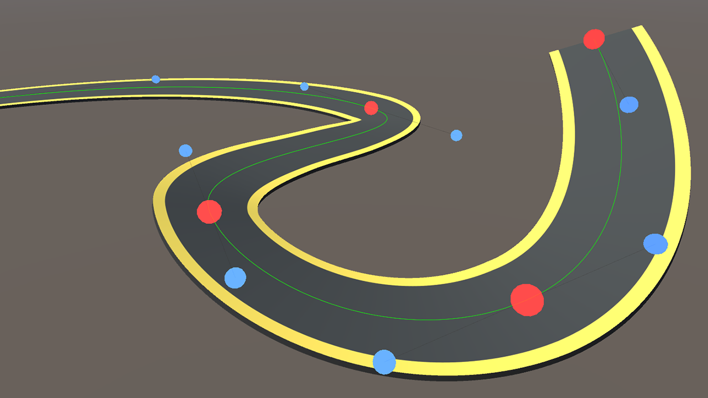

# Path Creator

Original from [SebLague](https://github.com/SebLague/Path-Creator).



## Table of Contents

* [Getting Started](#getting-started)
  * [Prerequisites](#prerequisites)
  * [Installation](#installation)
* [Usage](#usage)
* [Contributing](#contributing)
* [License](#license)

## Getting Started

### Prerequisites

* Unity 2018.1 and above.

### Installation

1. Open the `manifest.json` in your project

2. Specify the package URL

```json
{
  "dependencies": {
    "com.arsenstudio.pathcreator": "https://github.com/intelligide/pathcreator.git"
}
```

3. Open your project or reload it in the Unity Editor

## Usage

[Watch overview video](https://www.youtube.com/watch?v=saAQNRSYU9k)

Please refer to the [Documentation](https://docs.google.com/document/d/1-FInNfD2GC-fVXO6KyeTSp9OSKst5AzLxDaBRb69b-Y/edit?usp=sharing).

## Contributing

Contributions are what make the open source community such an amazing place to be learn, inspire, and create. Any contributions you make are **greatly appreciated**.

1. Fork the Project
2. Create your Feature Branch (`git checkout -b feature/AmazingFeature`)
3. Commit your Changes (`git commit -m 'Add some AmazingFeature'`)
4. Push to the Branch (`git push origin feature/AmazingFeature`)
5. Open a Pull Request

## License

Distributed under the MIT License. See [LICENSE](LICENSE.txt) for more information.
